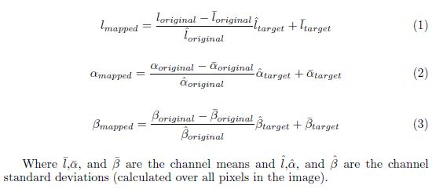

# Reinhard Stain Normalization

> This README is describing the Reinhard colour-normalization method as implemented in this folder.

## Introduction

This approach maps the colour distribution of an over/under-stained image to that
of a well-stained target image. Reinhard presented a method for matching the
colour distribution of an image to that of a target image by use of a linear
transform in a perceptual colourspace (the *lαβ* colourspace of Ruderman et al.),
so as to match the means and standard deviations of each colour channel in the two
images in that colourspace.

## Why the *lαβ* colourspace?

When a typical three-channel image is represented in any of the most well-known
colourspaces, there will be correlations between the different channels' values.
Ruderman et al. developed a colour space, called *lαβ*, which minimizes correlation
between channels for many natural scenes. This space is based on data-driven human
perception research that assumes the human visual system is ideally suited for
processing natural scenes. The authors discovered the *lαβ* colour space in the
context of understanding the human visual system.

### Conversion from RGB to *lαβ* and vice versa

For this, two routines are provided to perform the corresponding conversions:

- [`RGB2Lab.m`](RGB2Lab.m) — RGB → CIELAB
- [`Lab2RGB.m`](Lab2RGB.m) — CIELAB → RGB

These transforms are based on ITU-R Recommendation BT.709 using the D65 white point
reference. The error in transforming RGB → Lab → RGB is approximately 10⁻⁵.

Further details about these two routines may be found in their respective code.

## Working of the algorithm

Basically our aim is to make an image take on another image's look and feel — i.e.,
we would like some aspects of the distribution of data points in *lαβ* space to
transfer between images. For our purposes, the mean and standard deviations along
each of the three channels suffice. Thus, we compute these measures for both the
source and target images. Note that the means and standard deviations are computed
for each channel separately in *lαβ* space.

### Steps

1. Subtract the mean from the data points.
2. Scale the data points of the image by factors determined by the respective
   standard deviations.
3. Instead of adding back the means previously subtracted, add the means of the
   **target** channels.

The three steps above are done in *lαβ* space, and they are illustrated below:



Where *l̄*, *ᾱ*, and *β̄* are the channel means and *l̂*, *α̂*, and *β̂* are the
channel standard deviations (calculated over all pixels in the image).

4. Convert the result back to RGB space.

## Usage

The main routine is [`stainnorm_reinhard.m`](stainnorm_reinhard.m):

```matlab
% source : image whose stain is to be normalized
% target : well-stained reference image
norm_img = stainnorm_reinhard(source, target);
```

It converts the source and target to *lαβ* (via `RGB2Lab`), matches the per-channel
means and standard deviations of the source to those of the target, converts the
result back to RGB (via `Lab2RGB`), displays it, and writes the normalized image to
`rein.jpg`.

## Files

| File | Description |
|------|-------------|
| `stainnorm_reinhard.m` | Main routine performing Reinhard stain normalization. |
| `RGB2Lab.m` | Converts an image from RGB to the CIELAB colour space. |
| `Lab2RGB.m` | Converts an image from CIELAB back to RGB. |
| `rein.jpg` | Example normalized output. |
| `reinhard_steps.png` | Illustration of the per-channel mapping equations. |
| `license.txt` | BSD-style license (Copyright © 2013, Manohar Kuse). |
| `Reinhard_code_explain.docx` | Original write-up (source of this README). |

## References

1. Derek Magee, Darren Treanor, Doreen Crellin, Mike Shires, Katherine Smith,
   Kevin Mohee, and Philip Quirke: *Colour normalization in digital histopathology
   images.*
2. Reinhard, E., Adhikhmin, M., Gooch, B., Shirley, P.: *Color transfer between
   images.*

## License

See [`license.txt`](license.txt). Copyright © 2013, Manohar Kuse. All rights
reserved. Redistribution and use permitted under the stated BSD-style terms.
